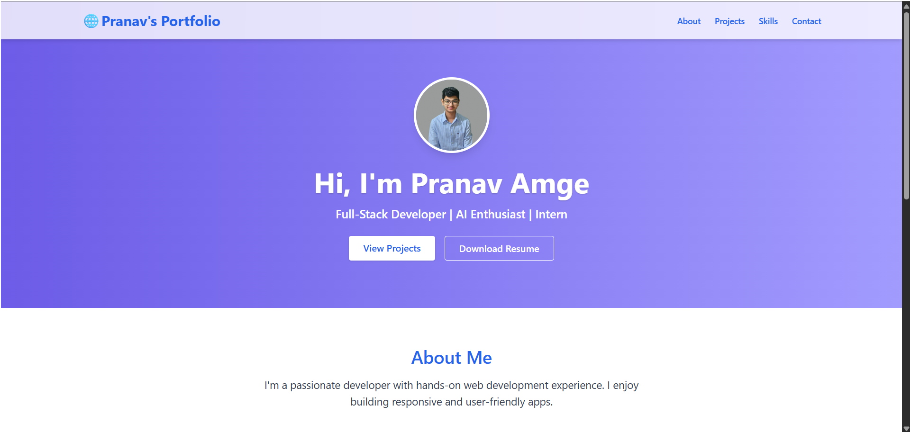
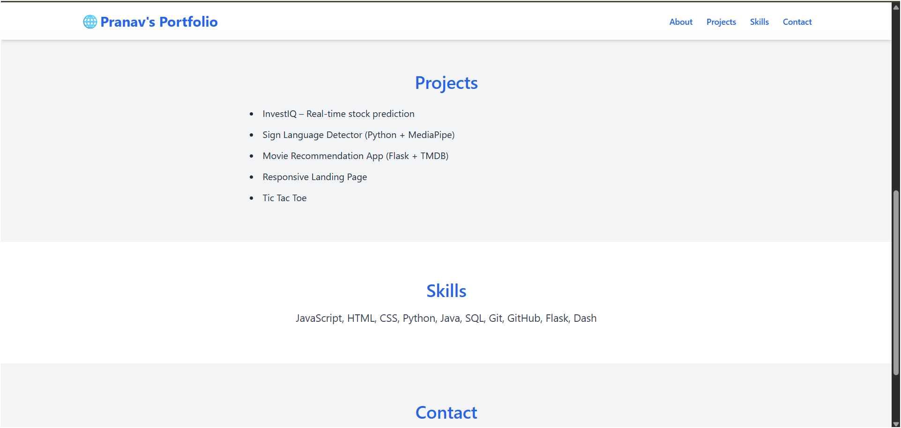

# 💼 Pranav Amge – Portfolio Website

This is a modern, responsive personal portfolio website built using **Next.js**, **Tailwind CSS**, and **TypeScript**.  
It showcases my **skills**, **projects**, and **contact details** in a clean and professional layout.

---

## 🚀 Tech Stack

- ⚛️ Next.js 14 (App Router)
- 🎨 Tailwind CSS
- 💻 TypeScript

---

## 📸 Screenshots

### 🏠 Home Page

### 💼 Projects Section

---

## 📁 Features

- Sticky Navigation Bar  
- Profile Image with Hero Section  
- Resume Download Button  
- Projects Display  
- Mobile Responsive Design  
- Smooth Scroll Navigation  
- Ready to deploy on Vercel

